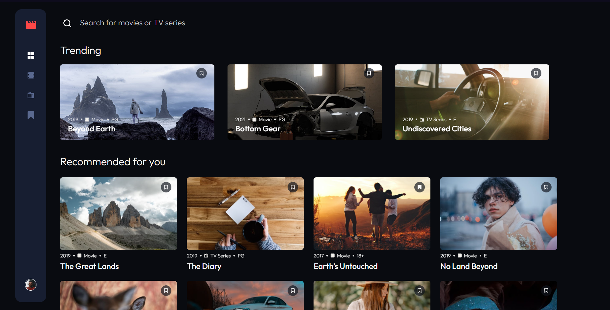
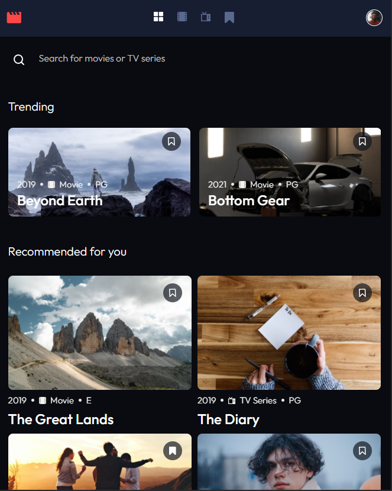

# Movies_API
This application displays the data receive from a json file to simulate an entertainment web application. For this purpose it was created using redux to agilize the process and json-server as a fake-server.
### Functionality
- Navigate between Home, Movies, TV Series, and Bookmarked Shows pages
- Search for relevant shows on all pages
- Add/Remove bookmarks from all movies and TV series
- Responsive according to device's screen size

## Installation
To install this project follow the next steps:
1.  Download the repository found here: [GitHub Repository](https://github.com/SuaferoanTJK/Movies_API)
2.  Run **npm install** script
3.  Run **npm run server** script to raise the database server.
4.  Run **npm run dev** script to raise the development server.
5.  Visit **localhost:3000**.

## Screenshots
### Home Page

### Movies Page

### TV Series Page

### Bookmarked Shows page

### Tablet Design

### Mobile Design

## Get in touch
### LinkedIn
https://www.linkedin.com/in/andrés-f-suárez/
